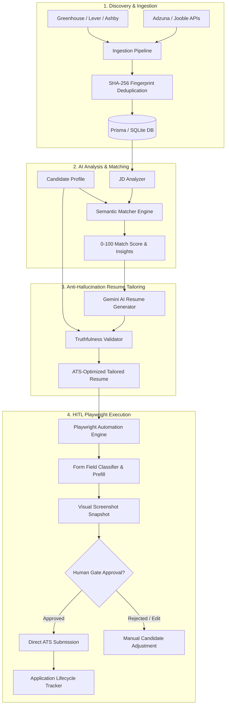

<div align="center">

# ⚡ Automated Jobs

### *The Autonomous Career Operating System & Intelligent Job Application Engine*

[](https://nextjs.org/)
[](https://www.typescriptlang.org/)
[](https://tailwindcss.com/)
[](https://www.prisma.io/)
[](https://playwright.dev/)
[](https://deepmind.google/technologies/gemini/)
[](LICENSE)

<p align="center">
  <a href="#-key-features">Key Features</a> •
  <a href="#-system-architecture">Architecture</a> •
  <a href="#-application-lifecycle">Lifecycle Flow</a> •
  <a href="#-quick-start">Quick Start</a> •
  <a href="#-environment-variables">Environment Setup</a> •
  <a href="#-security--ethical-automation">Ethical AI</a> •
  <a href="#-contributing">Contributing</a>
</p>

---

</div>

## 📌 Overview

**AutoApply AI** is a production-grade, AI-native job discovery and intelligent application platform designed to modernize candidate workflows. Instead of blindly blasting unvetted applications, AutoApply AI acts as an end-to-end **Career Copilot**:

1. **Aggregates and deduplicates** real postings across major ATS engines (Greenhouse, Lever, Ashby, Workable, SmartRecruiters) and job search APIs (Adzuna, Jooble).
2. **Semantically scores matches** against your verified experience profile, providing transparency into why a role fits and potential gap areas.
3. **Tailors ATS-compliant resumes** dynamically using Gemini AI with strict **anti-hallucination verification** against your true background.
4. **Automates ATS form-filling** with Playwright, featuring **Human-in-the-Loop (HITL)** safeguards, screenshot previews, and mandatory human review before dispatch.

---

## ✨ Key Features

### 🔍 1. Multi-Source Job Discovery & Ingestion
- **ATS Board Connectors**: Native adapters for **Greenhouse**, **Lever**, **Ashby**, **Workable**, and **SmartRecruiters**.
- **Search API Integrations**: Server-side integrations with **Adzuna** and **Jooble** job feeds.
- **SHA-256 Fingerprinting**: Unique hashing (`SHA256(company + title + location + sourceJobId)`) prevents redundant postings across multiple boards.

### 🧠 2. Semantic Matching & Requirement Parsing
- **Deep JD Analysis**: Extracts hard technical criteria, core competencies, experience tier, and visa sponsorship requirements.
- **Tri-Factor Scoring Engine**: Transparent 0–100 match ratings calculated across:
  - 🛠️ **Skills Match**
  - 📈 **Experience Level Match**
  - 🎯 **Domain & Industry Relevance**
- **Actionable AI Feedback**: Provides exact explanations (`whyMatchReason`), flags potential gaps (`potentialConcerns`), and suggests tactical interview angles (`suggestedAngle`).

### 📄 3. ATS-Tailored Resumes with Anti-Hallucination Guardrails
- **Targeted Bullet Generation**: Dynamically re-orders and highlights relevant achievements according to specific job descriptions.
- **Truthfulness Validator**: Every generated claim is automatically cross-referenced against your canonical profile. **Hallucinated or fabricated skills are rejected at generation time**.
- **Structured Sections**: Output formats structured for ATS parsers (Summary, Experience, Projects, Skills, Education).

### 🤖 4. Human-in-the-Loop (HITL) Automation Engine
- **Headless / Headful Playwright Automation**: Navigates complex multi-step ATS application portals.
- **Smart Field Classifier**: Detects and intelligently maps contact info, LinkedIn profiles, portfolio URLs, work history, and answers.
- **Sensitive Field Isolation**: Questions regarding salary expectations, visa sponsorship, and demographic info are flagged for mandatory human approval.
- **Safety Snapshot Previews**: Generates a pre-submission visual snapshot of the completed form so you know exactly what is being submitted.
- **Anti-Bot & CAPTCHA Detection**: Gracefully halts execution and notifies the user whenever manual verification or CAPTCHA interaction is required.

### 📊 5. Application State Machine & Kanban Tracking
- Complete audit trail logging for every action (`AuditLog`).
- Structured status pipeline from discovery to final offer.
- Real-time in-app notifications on submission status, reviews, and new high-fit job matches.

---

## 🏗️ System Architecture



---

## 🔄 Application Lifecycle

Every job application advances through an explicit state machine to guarantee complete user control:

```
[ DISCOVERED ]
      ↓
 [ MATCHED ] ────────► Low Fit? Dismiss with 1 click
      ↓
 [ SELECTED ]
      ↓
[ RESUME_READY ] ────► Tailored & verified against your profile
      ↓
[ APPLICATION_READY ] ► Form fields detected and prefilled
      ↓
[ WAITING_FOR_APPROVAL ] ───► ⚠️ MANDATORY USER REVIEW (Snapshot & Sensitive Fields)
      ↓
 [ SUBMITTED ]
      ↓
  [ TRACKING ] ──────► Screening ➔ Technical ➔ Interview ➔ Offer / Archived
```

---

## 🛠️ Tech Stack

| Category | Technology | Description |
|---|---|---|
| **Framework** | [Next.js 14](https://nextjs.org/) | App Router, Server Actions, API Route Handlers |
| **Frontend UI** | [React 18](https://react.dev/), [Tailwind CSS](https://tailwindcss.com/) | Responsive interface with custom design tokens |
| **UI Components** | [Radix UI](https://www.radix-ui.com/), [Lucide React](https://lucide.dev/) | Accessible primitives and modern icon set |
| **Animations** | [Framer Motion](https://www.framer.com/motion/) | Smooth state transitions and micro-interactions |
| **AI & LLM** | [Google Gemini API](https://deepmind.google/technologies/gemini/) | JD extraction, semantic matching, and resume tuning |
| **Automation** | [Playwright](https://playwright.dev/) | Headless browser execution, ATS form traversal |
| **Document Parsing**| [pdf-parse](https://www.npmjs.com/package/pdf-parse), [Mammoth](https://www.npmjs.com/package/mammoth) | Extraction from PDF and DOCX candidate resumes |
| **Database & ORM** | [Prisma](https://www.prisma.io/), [SQLite](https://sqlite.org/) / Postgres | Relational data persistence and migrations |
| **Auth & Cloud** | [Firebase](https://firebase.google.com/) | Authentication and Firestore synchronization |
| **Type Safety** | [TypeScript 5](https://www.typescriptlang.org/), [Zod](https://zod.dev/) | End-to-end schema validation |

---

## 📂 Project Structure

```bash
automated-jobs/
├── prisma/
│   ├── schema.prisma            # Multi-tenant schema (User, Profile, Jobs, Matches, Resumes)
│   └── dev.db                   # Local SQLite database
├── scripts/
│   ├── seed-firestore.ts        # Database seeding utilities
│   └── test-automation-engine.ts# Playwright automation harness
├── src/
│   ├── app/
│   │   ├── (workspace)/         # Protected user workspace routes
│   │   │   ├── applications/    # Application tracking & approval review
│   │   │   ├── jobs/            # Job board, search & semantic match details
│   │   │   ├── profile/         # Candidate master profile builder
│   │   │   ├── resumes/         # Tailored resume manager
│   │   │   ├── settings/        # Preferences & integration keys
│   │   │   └── upload/          # Resume upload & AI extraction
│   │   ├── api/                 # Next.js API route handlers
│   │   │   ├── applications/    # Application submission & approval endpoints
│   │   │   ├── jobs/            # Job search, sync & matching
│   │   │   ├── match/           # Semantic matching calculator
│   │   │   └── resumes/         # Tailoring & verification
│   │   ├── globals.css          # Design system & utility classes
│   │   └── layout.tsx           # Root application layout
│   ├── components/
│   │   ├── layout/              # Navbar, Sidebar, Footer
│   │   ├── sections/            # Landing page interactive sections
│   │   └── ui/                  # Reusable UI component library
│   ├── services/
│   │   ├── ai/                  # JD analyzer, Matcher, Resume generator, Truthfulness validator
│   │   ├── automation/          # Playwright workers, field detectors, prefillers
│   │   │   └── adapters/        # Greenhouse, Lever, Ashby, Adzuna, Workable adapters
│   │   └── ingestion/           # Data fetching and feed synchronization
│   └── types/                   # Shared TypeScript interfaces & types
├── .env.example                 # Environment variable template
├── package.json                 # Project dependencies & scripts
└── tailwind.config.js           # Tailwind theme configuration
```

---

## 🚀 Quick Start

### 1. Prerequisites
- **Node.js** v18.18+ or v20+
- **npm** or **pnpm**
- **Git**

### 2. Clone Repository
```bash
git clone https://github.com/raihan-codes/automated-jobs.git
cd automated-jobs
```

### 3. Install Dependencies
```bash
npm install
```

### 4. Install Playwright Browsers
```bash
npx playwright install chromium
```

### 5. Configure Environment Variables
Copy `.env.example` to `.env.local` and populate your keys:
```bash
cp .env.example .env.local
```

### 6. Initialize Database
Generate Prisma client and run initial database migrations:
```bash
npx prisma generate
npx prisma db push
```

### 7. Run the Development Server
```bash
npm run dev
```

Visit [http://localhost:3000](http://localhost:3000) in your browser.

---

## ⚙️ Environment Variables

| Variable | Required | Description |
|---|:---:|---|
| `DATABASE_URL` | **Yes** | Prisma connection string (e.g. `file:./dev.db`) |
| `NEXTAUTH_SECRET` | **Yes** | 32+ character secret for session signing |
| `NEXTAUTH_URL` | **Yes** | Canonical app URL (e.g. `http://localhost:3000`) |
| `NEXT_PUBLIC_APP_NAME` | No | Display name (defaults to `AutoApply AI`) |
| `ADZUNA_APP_ID` | Optional | Adzuna Job Search App ID |
| `ADZUNA_APP_KEY` | Optional | Adzuna Job Search Secret Key |
| `JOOBLE_API_KEY` | Optional | Jooble Job Feed API Key |
| `ENABLE_PLAYWRIGHT_HEADLESS` | Optional | Run browser invisibly (`true` or `false`) |
| `GOOGLE_CLIENT_ID` | Optional | OAuth 2.0 Google Client ID |
| `GOOGLE_CLIENT_SECRET` | Optional | OAuth 2.0 Google Client Secret |
| `GITHUB_CLIENT_ID` | Optional | OAuth 2.0 GitHub Client ID |
| `GITHUB_CLIENT_SECRET` | Optional | OAuth 2.0 GitHub Client Secret |
| `NEXT_PUBLIC_FIREBASE_*` | Optional | Firebase Auth & Firestore credentials |

---

## 🛡️ Security & Ethical Automation Guarantees

AutoApply AI adheres to strict principles of responsible job search automation:

1. **Anti-Spam & Rate Limiting**: The platform enforces reasonable submission cooldowns to respect employer ATS rate limits and prevent indiscriminate spamming.
2. **Zero Fabrication Policy**: Our built-in `TruthfulnessValidator` prevents the AI from fabricating employment history, metrics, or degrees. All tailored resumes are constrained strictly to verified facts.
3. **Mandatory Human-in-the-Loop**: No application can be dispatched automatically without passing the `WAITING_FOR_APPROVAL` checkpoint. You retain total agency over every submission.
4. **Data Privacy**: Candidate profiles, credentials, and answers remain securely isolated within your tenant database. Sensitive demographics and compensation queries are never logged without explicit consent.

---

## 🧪 Testing

To run the test suite and Playwright automation verification harness:

```bash
# Run linting checks
npm run lint

# Test automation engine against sample ATS forms
npx ts-node --compiler-options '{"target":"es2022","module":"commonjs"}' scripts/test-automation-engine.ts
```

---

## 🤝 Contributing

Contributions, issues, and feature requests are welcome!

1. Fork the Project
2. Create your Feature Branch (`git checkout -b feature/AmazingFeature`)
3. Commit your Changes (`git commit -m 'Add some AmazingFeature'`)
4. Push to the Branch (`git push origin feature/AmazingFeature`)
5. Open a Pull Request

---

## 📄 License

Distributed under the **MIT License**. See [`LICENSE`](LICENSE) for more details.

---

<div align="center">
  <sub>Built with ❤️ by <a href="https://github.com/raihan-codes">Raihan</a>. Powered by Next.js, Prisma, Playwright & Gemini AI.</sub>
</div>
